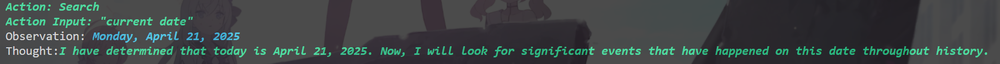
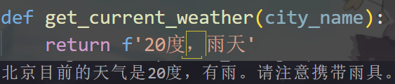
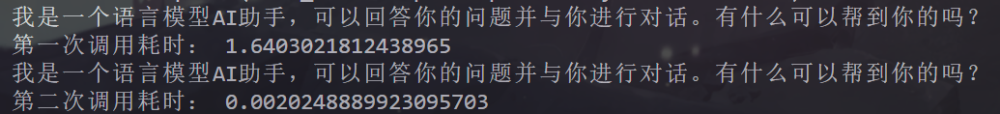
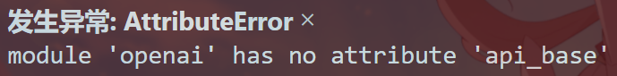
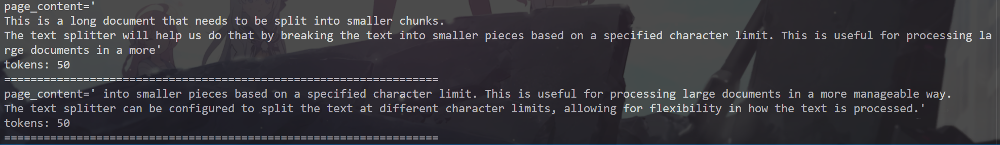
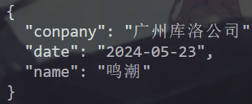

### langchain 入门

#### 一、介绍
1. 主要功能
- 将 LLM 与外部数据源进行连接
- 允许与 LLM 进行交互
2. 基础功能
- Models 模型：集成了很多流行的 LLM
- Loader 加载器：从指定源加载数据（文件夹、csv文件、网页等）
- Text Spltters 文本分割：将长文本分割成小块
- Vectorstores 向量数据库：将文本转换为向量存储
- Chains 链式处理：任务一个接一个去做
- Agent 代理：大模型自动选择调用哪个工具

#### 二、实战 
**1 Model（模型）**
**1.1 安装python环境**
- `conda create -n langchain python=3.9`
- 激活后下载requirements.txt中的包

**1.2 通过Google搜索并返回答案**
- 利用 agent 调用 serpapi 工具
- chat、agent 的调用方式都是使用 invoke 方法

**1.3 函数调用**
- 无法运行，晚些再看看原因
- 用的不是官方API，需要定义base_url访问自己的API网站

**1.4 缓存**
- 使用内存作为缓存存放位置，第二次回答明显更快

- 实现相似匹配
- 有问题，可能是版本不对，也可能是需要使用Openai而不是ChatOpenai

**1.5 async**
- 使用asyncio实现异步调用

**2. Data Connection（数据连接）**
**2.1 检索增强生成（RAG）**
- 文档加载器：从外部数据源加载数据
- 文本分割器：将长文本分割成小块

**2.2 文档加载器**
- CSV 加载器
- 文档目录 加载器
- HTML 加载器
- JSON 加载器

**2.3 文档转换器**

- 文本分割器：将长文本分割成小块
  - 基于字符分割
  - 基于Token分割

- 文本元数据提取
