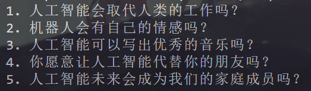
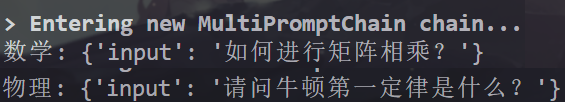
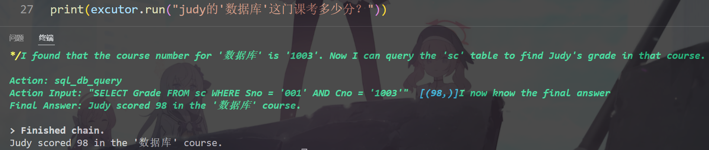

### langchain 入门

#### 一、介绍
1. 主要功能
- 将 LLM 与外部数据源进行连接
- 允许与 LLM 进行交互
2. 基础功能
- Models 模型：集成了很多流行的 LLM
- Loader 加载器：从指定源加载数据（文件夹、csv文件、网页等）
- Text Spltters 文本分割：将长文本分割成小块
- Vectorstores 向量数据库：将文本转换为向量存储
- Chains 链式处理：任务一个接一个去做
- Agent 代理：大模型自动选择调用哪个工具

#### 二、实战 
**1 Model（模型）**
**1.1 安装python环境**
`conda create -n langchain python=3.9`
激活后下载requirements.txt中的包

**1.2 通过Google搜索并返回答案**
利用 agent 调用 serpapi 工具
chat、agent 的调用方式都是使用 invoke 方法

**1.3 函数调用**
无法运行，晚些再看看原因
用的不是官方API，需要定义base_url访问自己的API网站

**1.4 缓存**
使用内存作为缓存存放位置，第二次回答明显更快

实现相似匹配
有问题，可能是版本不对，也可能是需要使用Openai而不是ChatOpenai

**1.5 async**
使用asyncio实现异步调用

**2. Data Connection（数据连接）**
**2.1 检索增强生成（RAG）**
- 文档加载器：从外部数据源加载数据
- 文本分割器：将长文本分割成小块

**2.2 文档加载器**
- CSV 加载器
- 文档目录 加载器
- HTML 加载器
- JSON 加载器

**2.3 文档转换器**

文本分割器：将长文本分割成小块
- 基于字符分割
- 基于Token分割

文本元数据提取（提取一段话的指定内容）

**2.4 嵌入与向量数据库**
比较两句话之间的向量相似度

多重提问检索器
当用户提出一个问题时，困难存在多种表达方式。通过用户的问题进行衍生，生成多种表达方式，然后进行检索，可以提高准确率。(问：疾病的特点？)

上下文压缩检索器
当初始文档过长时，直接给LLM会增加响应时间，可通过LLMChainExtractor将文档压缩成简短的上下文，然后再给LLM进行回答。

**后续部分暂时跳过**

**3. Chains（链式处理）**
**3.1 LLM Chain**
单链条，一个输入一个输出，主要利用后面的方法将一个个单链条串起来

**3.2 Simple Sequential Chain**
简单的顺序链，将前面的单链条的输出作为后面单链条的输入，也就是可以一个个串起来

**3.3 Sequential Chain**
与刚刚不同的时，此时可以运行接收多个输入，多个输出，核心仍是顺序链（一个接一个）

**3.4 Router Chain**
首先定义一个模板信息的字典列表，记录模板的名称、作用和内容
然后根据LLMChain定义一个个单链（合理选择llm和prompt），并用字典将其存储起来
最后创建路由链，将前面的单链字典作为输入，即可自动选择合适的单链进行解决问题

**3.5 TransformerChain**
允许用户对内容进行自定义处理后，再传给下一个链，相当于将 LLM 替换为用户自己处理

**3.6 Sumarize Chain**
专门对文档进行总结的链，有三种默认总结的方法。
- stuff：将所有文档一次性传给 LLM
- map_reduce：对每一个document进行总结，然后将总结的内容汇总再总结一次
- refine：迭代总结，总结完上一个document后，将其与下一个document一起总结

**3.7API Chain**

**3.8 SQL Chain**
用自然语言的方式提问，自动生成SQL语句进行查询

**3.9 QA Chain**
RetrievalQA：问答链，将RAG检索到的内容作为提示词上下文传给LLM进行回答
ConversationalRetrievalQA：对话式问答链，允许用户与LLM进行多轮对话，并将对话保存下来

**3.10 LCEL 管道操作符**
上游输出 | 下游输入
还可以用ConfigurableField来配置链的参数，此外可以设置一个备用方案，当上游链报错时，自动使用备用方案进行处理
在获取输入的时候，RunnablePassthrough.assign可以给我们传入的内容进行一定的修改，然后他返回的是question键的字典，也就是说后续输入要用question接收

**4. Prompts（提示词）**
**4.1 Promt 书写技巧**
设定界定符或占位符：
> 请帮我总结一段话，"""要总结的内容 """
> 格式按下方来：
> name:<chinese_name>
> nickname:<nickname>
> age:<20-40>

角色扮演：
> 你是一个资深的医生，请帮我分析一下这段话的内容
> 由于不同学术流派对同一问题有不同的理解，角色扮演可以突出某个领域的专业性

思维链：
> 给一个计算题，明确指定要一步步算，这样大模型的准确率会明显提高

**4.2 PromptTemplate**
